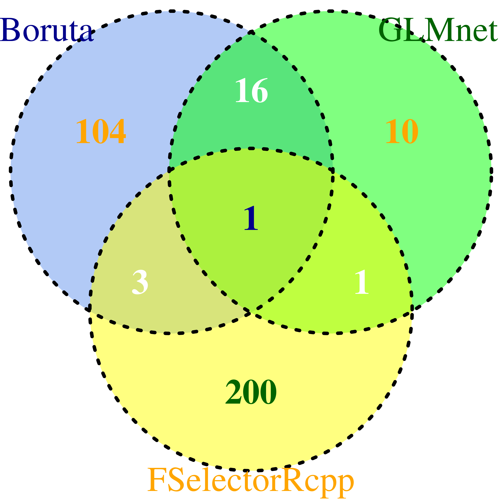

```{r setup, include=FALSE}
knitr::opts_chunk$set(echo = TRUE)
```

# Czym jest klasyfikacja?

Klasyfikacja polega na przewidywaniu **dyskretnej** zmiennej objaśnianej.

Przykładowe problemy klasyfikacji:

  - Czy wiadomość email jest spamem, czy nie?
  - Czy transakcja jest oszustwem, czy nie?
  - Czy nowotwór jest złośliwy, czy nie?

Najprostszą wersją tego zagadnienia jest klasyfikacja binarna, gdzie zmienna objaśniana Y z założenia może przyjąć tylko jedną z dwóch wartości -- Fałsz (0) lub Prawdę (1).

# Regresja liniowa w problemie klasyfikacji

```{r message = FALSE}
library(ggplot2)
```

```{r}
tumor <- data.frame(x = c(1:4, 6:9), y = c(rep(c(0, 1), each = 4)))
lm_model <- lm(formula = y ~ x, data = tumor)

plot(x = tumor$x,
     y = tumor$y,
     main = "Regresja liniowa – dobra?",
     xlab = "Rozmiar guza [j]",
     ylab = "Złośliwy?",
     xlim = c(0, 10),
     axes = FALSE)
axis(1, at = 0:10)
axis(2, at = c(0, 1))
curve(predict(object = lm_model, data.frame(x = x), type = "resp"),
      col = "blue", add = TRUE)
points(5, 0.5, cex = 2, col = "green", pch = "|")
lines(x = c(5, 5), y = c(0, 1), col = "red", lty = 2)

ggplot(data = tumor, mapping = aes(x = x, y = y)) +
  geom_point() +
  stat_smooth(method = "lm", col = "blue") +
  geom_point(mapping = aes(x = x, y = y),
             data = data.frame(x = 5, y = 0.5),
             cex = 8, col = "green", pch = "|") +
  geom_vline(xintercept = 5, col = "red", lty = 2) +
  scale_y_continuous(breaks = c(0, 1), labels = c("Nie", "Tak")) +
  labs(x = "Rozmiar guza [j]", y = "Złośliwy?") +
  ggtitle("Regresja liniowa – dobra?") +
  theme(plot.title = element_text(hjust = 0.5))
```

```{r}
tumor[9, ] <- c(20, 1)
lm_model <- lm(formula = y ~ x, data = tumor)

plot(x = tumor$x,
     y = tumor$y,
     main = "Regresja liniowa – nie dobra!",
     xlab = "Rozmiar guza [j]",
     ylab = "Złośliwy?",
     xlim = c(0, 20),
     axes = FALSE)
axis(1, at = 0:20)
axis(2, at = c(0, 1), labels = c("Nie", "Tak"))
curve(predict(object = lm_model, data.frame(x = x), type = "resp"),
      col = "blue", add = TRUE)
points(7, 0.575, cex = 2, col = "green", pch = "|")
lines(x = c(7, 7), y = c(0, 1), col = "red", lty = 2)

ggplot(data = tumor, mapping = aes(x = x, y = y)) +
  geom_point() +
  stat_smooth(method = "lm", col = "blue") +
  geom_point(mapping = aes(x = x, y = y),
             data = data.frame(x = 7, y = 0.575),
             cex = 8, col = "green", pch = "|") +
  geom_vline(xintercept = 7, col = "red", lty = 2) +
  scale_y_continuous(breaks = c(0, 1), labels = c("Nie", "Tak")) +
  labs(x = "Rozmiar guza [j]", y = "Złośliwy?") +
  ggtitle("Regresja liniowa – nie dobra!") +
  theme(plot.title = element_text(hjust = 0.5))
```

Dziwnym byłoby przewidywanie wartości Y wykraczającej poza przedział [0, 1], (poza "Nie" i "Tak").

# Regresja logistyczna

Najpopularniejszym algorytmem służącym do rozwiązywania problemów klasyfikacji jest **regresja logistyczna**. Wykorzystuje ona funkcję sigmoidalną zadaną wzorem $g(z) = \frac{1}{1 + e^{-x}}$.

```{r}
glm_model <- glm(formula = y ~ x, family = binomial, data = tumor)

plot(x = tumor$x,
     y = tumor$y,
     main = "Regresja logistyczna",
     xlab = "Rozmiar guza [j]",
     ylab = "Złośliwy?",
     xlim = c(0, 20),
     axes = FALSE)
axis(1, at = 0:20)
axis(2, at = c(0, 1), labels = c("Nie", "Tak"))
curve(predict(object = glm_model, data.frame(x = x), type = "resp"),
      col = "blue", add = TRUE)
points(5, 0.5, cex = 2, col = "green", pch = "|")

ggplot(data = tumor, mapping = aes(x = x, y = y)) +
  geom_point() +
  stat_smooth(method = "glm", method.args = list(family = "binomial"),
              col = "blue") +
  geom_point(mapping = aes(x = x, y = y),
             data = data.frame(x = 5, y = 0.5),
             cex = 8, col = "green", pch = "|") +
  geom_vline(xintercept = 5, col = "red", lty = 2) +
  scale_y_continuous(breaks = c(0, 1), labels = c("Nie", "Tak")) +
  labs(x = "Rozmiar guza [j]", y = "Złośliwy?") +
  ggtitle("Regresja logistyczna") +
  theme(plot.title = element_text(hjust = 0.5))
```

## Operacje na danych biologicznych.

`broom` -- pakiet ułatwiający korzystanie z modeli otrzymanych za pomocą podstawowego pakietu `stats`.

`caret` -- pakiet ujednolicający niezwykle bogate środowisko pracy (bazujące na wielu innych pakietach) w uczeniu statystycznym.

`corrplot` -- pakiet służący do wizualizacji macierzy korelacji

Nie będziemy zagłębiać się w pakiet `caret`. Posłużymy się nim tylko do preprocessingu.

```{r}
library(broom)
library(caret)
library(corrplot)
```

## Podział danych na dwa zestawy -- treningowy i testowy.

Na zestawie treningowym wyszkolimy model regresji logistycznej, który wypróbujemy później na zbiorze testowym. W przygotowaniu zbiorów pomoże nam funkcja `createDataPartition` z pakietu `caret`. Dzięki niej mamy pewność, że unikniemy przypadkowego przydzielenia np. wszystkich zmarłych pacjentów tylko i wyłącznie do jednego z zestawów. Na początek przyjrzyjmy się, czy chcemy budować model na wszystkich dostępnych zmiennych w ramce danych. We wstępnej selekcji również pomogą nam funkcje z pakietu `caret`.

```{r}
data_set <- read.csv("../data/bio_data.csv")

# Pozbycie się niepełnych obserwacji i identyfikatora
data_set <- data_set[complete.cases(data_set),
                     colnames(data_set) != "bcr_patient_barcode"]

# Sprawdzenie, czy któreś ze zmiennych objaśniajacych nie posiadają wariancji bliskiej zeru
near_zero_var <- nearZeroVar(x = data_set, saveMetrics = TRUE)
near_zero_var

# Sprawdzenie, czy niektóre zmienne nie są ze sobą silnie skorelowane
matrix_set <- data.matrix(data_set)
correlation <- cor(matrix_set)
summary(correlation[upper.tri(correlation)])
corrplot(correlation)
corrplot(correlation, method = "number", type = "upper")
diag(correlation) <- NA
corrplot(correlation)
corrplot(correlation, na.label = "NA")
find_correlation <- findCorrelation(correlation, cutoff = .5,
                                    verbose = TRUE, names = TRUE)
find_correlation

# Sprawdzenie liniowych zależności
comboInfo <- findLinearCombos(matrix_set)
comboInfo
```

```{r}
set.seed(42)
train_rows <- createDataPartition(y = data_set$status, p = 0.8, list = FALSE)
train <- data_set[train_rows, ]
test <- data_set[-train_rows, ]
```

## Szkolenie modelu

Kropka w formule oznacza, że chcemy stworzyć model od wszystkich dostępnych zmiennych objaśniających.

```{r}
glm_model <- glm(formula = status ~ ., data = train)
```

Przyjrzyjmy się wyszkolonemu modelowi

```{r}
glm_model
```

Informacje nie są zbyt czytelne. W celu ujednolicenia informacji o modelu posłużymy się funkcjami z pakietu `broom`.

```{r}
glm_tidy <- tidy(glm_model)
glm_tidy
glm_glance <- glance(glm_model)
glm_glance
```

Możemy zauważyć, że ciągła zmienna objaśniająca `times` występuje tylko raz, natomiast każda dyskretna zmienna objaśniająca (np. `cancer`) została zastąpiona o jedną mniej zmienną niż posiadała pierwotnie (w tym wypadku dwoma). Każda z tych nowych zmiennych (tzw. dummy variables) przybierają wartości 0 i 1 (dla danej obserwacji wystąpił dany typ raka, albo nie wystąpił). Wariantowi z trzecią -- brakującą zmienną -- odpowiada sytuacja, w której wszystkie nowopowstałe zmienne (od danej zmiennej) przyjmują wartość 0.

Przyjrzyjmy się istotności poszczególnych cech.

```{r}
summary(glm_model)
```

Możemy zauważyć, że istotnych jest 5 zmiennych objaśniających (przy czym trzy wywodzą się z dwóch kategorycznych). Zapiszmy sobie ich nazwy na przyszłość. Nie zapomnijmy przy tym, o zmiennej objaśnianej.

```{r}
significant_attributes <- c("status", "times", "cancer", "TP53", "ADCY8")
```

## Predykcja

```{r}
prediction <- predict(object = glm_model, newdata = test, type = "response")
prediction <- round(x = prediction, digits = 0)
prediction_frame <- data.frame(actual = test$status, predicted = prediction,
                               row.names = 1:length(test$status))
prediction_frame <- sapply(X = prediction_frame, FUN = plyr::mapvalues,
                           from = c(0, 1), to = c("Survived", "Passed"))
prediction_frame <- as.data.frame(prediction_frame)
confusion_matrix <- table(prediction_frame$predicted, prediction_frame$actual,
                          dnn = c("predicted", "actual"))
confusion_matrix <- confusionMatrix(confusion_matrix, positive = "Passed")
confusion_matrix
glm_score <- confusion_matrix$byClass["Sensitivity"] +
  confusion_matrix$byClass["Specificity"]
glm_score <- unname(glm_score)
glm_score
unname(glm_score/2 == confusion_matrix$byClass["Balanced Accuracy"])
```

Wizualizacja macierzy pomyłek.

```{r}
actual_class <- rep(dimnames(confusion_matrix$table)$actual,
                    each = 2)
prediction_class <- rep(dimnames(confusion_matrix$table)$predicted,
                        times = 2)
label <- paste(c("True Positive", "False Negative",
                 "False Positive", "True Negative"),
               as.vector(confusion_matrix$table),
               sep = "\n")
fill <- c("green", "red", "red", "green")
confusion_frame <- data.frame(actual = actual_class,
                              prediction = prediction_class,
                              label = label,
                              fill = fill)

glm_confusion_matrix <- ggplot(data =  confusion_frame,
                               mapping = aes(x = actual, y = prediction,
                                             fill = fill, label = label)) +
  geom_tile() +
  geom_text() +
  scale_fill_identity() +
  scale_x_discrete(position = "top") +
  scale_y_discrete(limits = rev(levels(confusion_frame$prediction))) +
  ggtitle("Macierz pomyłek") +
  theme_bw() +
  theme(plot.title = element_text(hjust = 0.5))
glm_confusion_matrix
```

Parametrów wynikających z macierzy pomyłek jest znacznie więcej. Skupimy się na dwóch poniższych. Za ich pomocą będziemy oceniać skuteczność naszego modelu.

- True Positive Rate -- TPR, Sensitivity

    $True Positive Rate = \frac{True Positive}{True Positive + False Negative}$
    
- True Negative Rate -- TNR, Specificity

    $True Negative Rate = \frac{True Negative}{True Negative + False Positive}$

Oba te parametry uwzględniają liczebność swoich klas, co jest **bardzo** istotne w ocenie modelu. W naszym przypadku klasy różnią się od siebie liczebnością w znaczącym stopniu (zmarło 40 pacjentów, przeżyło 205). Zauważmy, że naiwnie zakładając przeżycie każdego pacjenta otrzymujemy aż 205 trafnych predykcji z 245 uzyskując tylko pozornie lepszy model. Dlatego tak **bardzo** ważne jest uwzględnienie liczebności klas.

```{r}
205/245
glm_score/2
205/245 > glm_score/2
```

## Selekcja zmiennych -- uproszczenie modelu

Dobór zmiennych ma na celu sprawienie, że model będzie bardziej zrozumiały dla człowieka. Łatwiej jest wyjaśnić pewne prawa i zachowania bazując na mniejszej ilości predyktorów. Zbudujmy więc tym razem model tylko na tych zmiennych, które okazały się istotne przy budowaniu wcześniejszego modelu.

```{r}
# Wybór zmiennych w zbiorze treningowym i testowym
train_lite <- train[, significant_attributes]
test_lite <- test[, significant_attributes]

# Szkolenie i podsumowanie modelu
glm_model_lite <- glm(formula = status ~ ., data = train_lite)
summary(glm_model_lite)

# Predykcja
prediction_lite <- predict(object = glm_model_lite, newdata = test_lite,
                           type = "response")
prediction_lite <- round(x = prediction, digits = 0)
prediction_frame_lite <- data.frame(actual = test_lite$status,
                                    predicted = prediction_lite,
                                    row.names = 1:length(test_lite$status))
prediction_frame_lite <- sapply(X = prediction_frame_lite,
                                FUN = plyr::mapvalues,
                                from = c(0, 1),
                                to = c("Survived", "Passed"))
prediction_frame_lite <- as.data.frame(prediction_frame_lite)
confusion_matrix_lite <- table(prediction_frame_lite$predicted,
                          prediction_frame_lite$actual,
                          dnn = c("predicted", "actual"))
confusion_matrix_lite <- confusionMatrix(confusion_matrix_lite,
                                         positive = "Passed")
confusion_matrix_lite
glm_score_lite <- confusion_matrix_lite$byClass["Sensitivity"] +
  confusion_matrix_lite$byClass["Specificity"]
glm_score_lite <- unname(glm_score_lite)

# Czy wyniki są takie same?
glm_score == glm_score_lite
```

Dostaliśmy taki sam wynik dla znacznie prostszego modelu -- super!

## Algorytmy doboru zmiennych

Czy zawsze musimy budować model na wszystkich zmiennych, patrzeć na ich poziom istotności, usuwać te najmniej istotne, budować nowy model i powtarzać całą operację?

Do pomocy w automatyzacji tego procesu przybywa pakiet `leaps`. Dzięki niemu w prosty sposób możemy przeprowadzić na swoim zbiorze danych jedną z trzech selekcji zmiennych

- Best Subset Regression

    tworzy $2^p$ modeli, gdzie $p$ to liczba zmiennych objaśniających
    
- Forward/Backward Stepwise Selection

    tworzy $p^2$ modeli

*Best Subset Regression* tworzy modele na zasadzie "każda cecha każdą". *Forward/Backward Stepwise Selection* dobierają jedną cechę i do niej dobierają następną, poźniej do dwóch poprzednich kolejną aż do ich wyczerpania. *Best Subset Regression* jest czasochłonne pod względem obliczeniowym. Zróbmy zatem *Forward Stepwise Selection*.

```{r}
library(leaps)

number_of_features <- nrow(glm_tidy) - 1
glm_model_fss <- regsubsets(x = status ~ ., data = train,
                            nvmax = number_of_features, method = "forward")
plot(glm_model_fss, scale = "Cp")
glm_model_fss_summary <- summary(glm_model_fss)
glm_model_fss_summary
plot(glm_model_fss_summary$cp, xlab = "Liczba predyktorów", ylab = "Cp")
points(which.min(glm_model_fss_summary$cp),
       min(glm_model_fss_summary$cp),
       pch = 20,
       col = "red")
```

Współczynnik Cp Mallowa uwzględnia rozmiar modelu. Można by wyjść z założenia, że im bardziej skomplikowany -- polegający na większej ilości predyktorów model -- tym lepszy. Nie jest to prawdą. Przy bardzo mocnym dopasowaniu modelu do danych może dojść do tzw. *overfittingu*. Model zbyt mocno dopasowany do danych może dawać gorsze predykcje niż ten spasowany w mniejszym stopniu. Okazuje się, że najodpowiedniejszy model w tym przypadku, to taki zbudowany na 6 zmiennych (o jedną więcej niż poprzedni model).

## k-krotna kroswalidacja

Jedną z najpopularniejszych metod doboru zmiennych jest *k-krotna kroswalidacja*, gdzie k najczęściej przybiera wartość 5 lub 10. Polega ona na dzieleniu zbioru testowego na $k$ podzbiorów, szkoleniu modelu na $k - 1$ podzbiorach, walidacji tego modelu na jednym podzbiorze (walidacyjnym) i powtórzeniu całej operacji $k$ razy, za każdym razem przyjmując za zbiór walidacyjny inny podzbiór. Błędy dla każdego rozmiaru modelu ze wszystkich $k$ modeli są uśredniane.

```{r}
# Na ile foldów (podzbiorów) podzielimy nasz zestaw treningowy
K <- 10

# Podział zestawu treningowego na podzbiory
set.seed(42)
folds <- sample(rep(1:K, length = nrow(train)))
table(folds)

# Macierz błędów
cv_errors <- matrix(NA, K, number_of_features)

# k-krotna kroswalidacja
predict.regsubsets <- function(object, formula, data, id) {
  mat <- model.matrix(formula, data)
  coefi <- coef(object, id = id)
  mat[, names(coefi)] %*% coefi
}

for (k in 1:K) {
  form <- as.formula(status ~ .)
  best_fit <- regsubsets(form,
                         train[folds != k, ],
                         nvmax = number_of_features,
                         method = "forward")
  for (i in 1:(glm_model_fss$nvmax - 1)) {
    pred <- predict.regsubsets(best_fit, form, train[folds == k, ], id = i)
    cv_errors[k, i] <- mean((train$status[folds == k] - pred) ^ 2)
  }
}

rmse_cv <- sqrt(apply(cv_errors, 2, mean))

plot(
  rmse_cv,
  xlab = "Rozmiar modelu",
  ylab = "Średnia kwadratowa błędów",
  pch = 19,
  type = "b"
)
points(which.min(rmse_cv),
       min(rmse_cv),
       pch = 20,
       col = "red")
```


# Inne algorytmy związane z doborem zmiennych

- Regresja Grzbietowa (Ridge Regression)
- Lasso

# Inne algorytmy związane z klasyfikacją

- Liniowa analiza dyskryminacyjna (LDA)

    Bardziej stabilna metoda klasyfikacji niż regresja logistyczna w wypadku, gdy istnieją zmienne objaśniające potrafiące niemalże idealnie odróżnić klasy (dla takich zmiennych współczynniki przy regresji logistycznej dążyłyby do nieskończoności). Regresja logistyczna została opracowana na płaszczyźnie biologii i medycyny, gdzie tak silne predyktory nie występują. LDA jest bardziej popularne w sytuacji, gdy mamy do czynienia z wiekszą ilością klas niż dwie.

- k najbliższych sąsiadów (k-NN)

    

- Lasy losowe (Random forest)

    

- Maszyna wektorów nośnych (SVM)

    

- Algorytm centroidów (k-means)

    Należy do grupy algorytmów uczenia bez nadzoru (przydziela obserwacje do klas nie mając wcześniej informacji, że takie istnieją).

- Sieci neuronowe


# Koniec

Na zakończenie  -- selekcja zmiennych za pomocą 3 metod na zbiorze danych zawierających eskpresje genów w postaci 20 tysięcy zmiennych.

